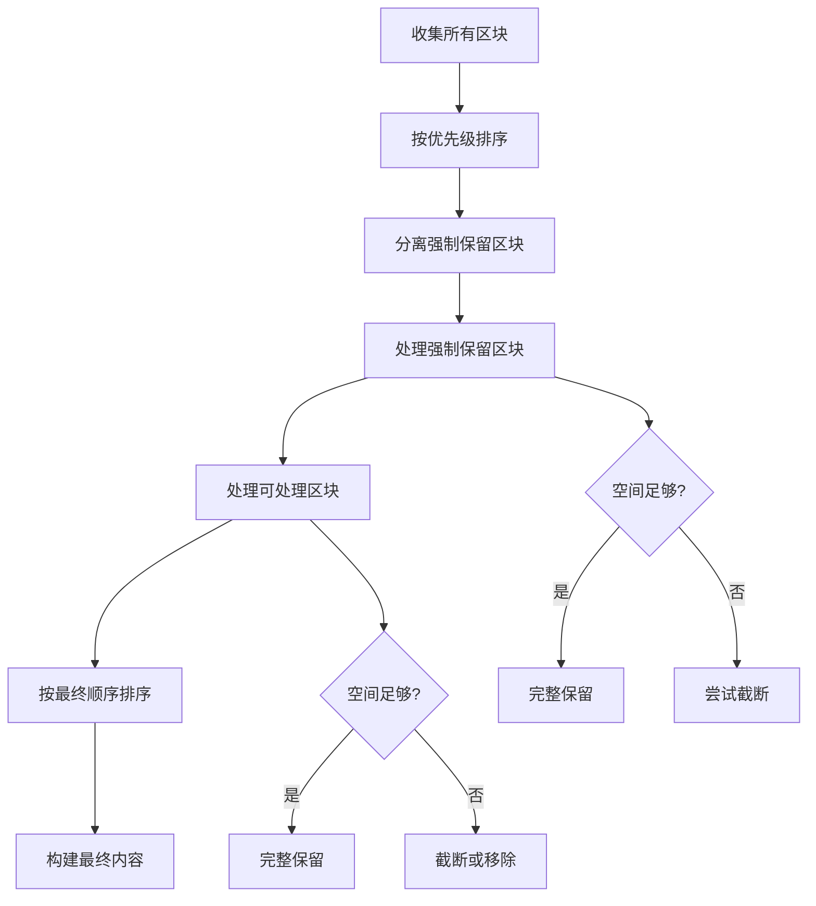

# 上下文区块索引文档

本文档详细说明了 AI 提交信息生成器中使用的所有上下文区块，包括它们的作用、优先级、截断策略和使用场景。

## 📋 区块概览

| 区块名称 | 优先级 | 截断策略 | 强制保留 | 作用描述 |
|---------|--------|----------|----------|----------|
| `code-changes` | 100 | SmartTruncateDiff | ✅ | 当前提交的代码变更内容 |
| `user-commits` | 950 | TruncateTail | ✅ | 用户最近的提交历史 |
| `recent-commits` | 950 | TruncateTail | ✅ | 仓库最近的提交历史 |
| `reminder` | 900 | TruncateTail | ✅ | 系统提醒和指导信息 |
| `custom-instructions` | 750 | TruncateTail | ❌ | 用户自定义指令 |
| `original-code` | 800 | SmartTruncateDiff | ❌ | 原始代码内容 |
| `similar-code` | 320 | TruncateTail | ❌ | 相似代码上下文 |

## 🔍 详细区块说明

### 1. `code-changes` - 代码变更区块
- **优先级**: 100 (最高)
- **截断策略**: SmartTruncateDiff
- **强制保留**: ✅
- **作用**: 包含当前提交的所有代码变更内容，是生成提交信息的核心依据
- **内容来源**: 从 `extractProcessedDiff()` 提取的代码变更部分
- **重要性**: 最高，这是 AI 分析的主要对象

### 2. `user-commits` - 用户提交历史区块
- **优先级**: 950 (高)
- **截断策略**: TruncateTail
- **强制保留**: ✅
- **作用**: 提供用户最近的提交历史，用于风格参考
- **内容来源**: `ContextCollector.getRecentCommits()` 获取的用户提交记录
- **触发条件**: 用户主动开启 `useRecentCommitsAsReference` 功能
- **重要性**: 用户主动开启，强制保留

### 3. `recent-commits` - 仓库提交历史区块
- **优先级**: 950 (高)
- **截断策略**: TruncateTail
- **强制保留**: ✅
- **作用**: 提供仓库中其他人的最近提交，用于风格参考
- **内容来源**: `ContextCollector.getRecentCommits()` 获取的仓库提交记录
- **触发条件**: 用户主动开启 `useRecentCommitsAsReference` 功能
- **重要性**: 用户主动开启，强制保留

### 4. `reminder` - 系统提醒区块
- **优先级**: 900 (高)
- **截断策略**: TruncateTail
- **强制保留**: ✅
- **作用**: 包含系统提醒信息，如语言要求、分析指导等
- **内容来源**: `ContextCollector.getReminder()` 生成的提醒信息
- **包含内容**:
  - 多文件变更分析指导
  - 语言要求（如 "MUST be in Chinese"）
  - 不要复制历史提交的提醒
- **重要性**: 系统核心指导，强制保留

### 5. `custom-instructions` - 自定义指令区块
- **优先级**: 750 (中高)
- **截断策略**: TruncateTail
- **强制保留**: ❌
- **作用**: 包含用户提供的自定义指令和要求
- **内容来源**: `ContextCollector.getSCMInputContext()` 获取的用户输入
- **格式**: 包装在 `<instructions>` 标签中
- **重要性**: 用户特定要求，但可被截断

### 6. `original-code` - 原始代码区块
- **优先级**: 800 (高)
- **截断策略**: SmartTruncateDiff
- **强制保留**: ❌
- **作用**: 提供原始代码内容，用于对比分析
- **内容来源**: 从 `extractProcessedDiff()` 提取的原始代码部分
- **可排除**: 可通过 `exclude` 选项排除
- **重要性**: 提供上下文，但可被截断或排除

### 7. `similar-code` - 相似代码区块
- **优先级**: 320 (低)
- **截断策略**: TruncateTail
- **强制保留**: ❌
- **作用**: 提供与当前变更相似的代码上下文
- **内容来源**: `ContextCollector.getSimilarCodeContext()` 通过嵌入搜索获取
- **可排除**: 可通过 `exclude` 选项排除
- **重要性**: 辅助参考，优先级最低

## 🎯 优先级设计理念

### 优先级分配原则
1. **核心分析对象** (100): 最高优先级，强制保留 - AI 分析的主要依据
2. **用户主动开启的功能** (950): 高优先级，强制保留 - 用户明确要求
3. **系统核心指导** (900): 高优先级，强制保留 - 系统重要信息
4. **重要参考区块** (800): 高优先级，可截断 - 提供上下文
5. **用户自定义内容** (750): 中高优先级，可截断 - 用户特定要求
6. **辅助参考区块** (320): 低优先级，可截断 - 辅助信息

### 强制保留机制
强制保留的区块在空间不足时：
- 不会被完全移除
- 会尝试截断而不是删除
- 只有 `code-changes` 在极端情况下才会被截断

## 🔄 截断策略说明

### TruncateTail
- **适用区块**: 文本类内容
- **策略**: 从尾部截断，保留开头部分
- **使用场景**: 提交历史、提醒信息、自定义指令等

### SmartTruncateDiff
- **适用区块**: 代码变更内容
- **策略**: 智能截断，优先保留文件头和重要变更
- **使用场景**: 代码变更、原始代码等

## 📊 区块处理流程



## 🛠️ 配置选项

### 排除选项
可以通过 `exclude` 参数排除特定区块：
```typescript
const options = {
  exclude: ["similar-code", "original-code"]
};
```

### 强制保留配置
在 `constants.ts` 中配置强制保留的区块：
```typescript
export const FORCE_RETAIN_BLOCKS: string[] = [
  "code-changes",
  "user-commits",
  "recent-commits", 
  "reminder"
];
```

## 📝 使用示例

### 基本使用
```typescript
const contextBuilder = new CommitContextBuilder();
const contextManager = await contextBuilder.buildContextManager(
  selectedModel,
  systemPrompt,
  scmProvider,
  diffContent,
  configuration
);
```

### 排除特定区块
```typescript
const contextManager = await contextBuilder.buildContextManager(
  selectedModel,
  systemPrompt,
  scmProvider,
  diffContent,
  configuration,
  { exclude: ["similar-code"] }
);
```

## 🔧 扩展指南

### 添加新区块
1. 在 `ContextCollector` 中添加收集方法
2. 在 `CommitContextBuilder` 中添加区块
3. 在 `FINAL_BLOCK_ORDER` 中定义排序位置
4. 根据需要添加到 `FORCE_RETAIN_BLOCKS`

### 修改优先级
在 `CommitContextBuilder` 中调整 `priority` 值：
- 数字越小优先级越高
- 建议使用 100 的倍数便于管理

### 自定义截断策略
在 `TruncationStrategy` 枚举中添加新策略，并在 `ContentTruncator` 中实现。

---

*最后更新: 2024年12月*
